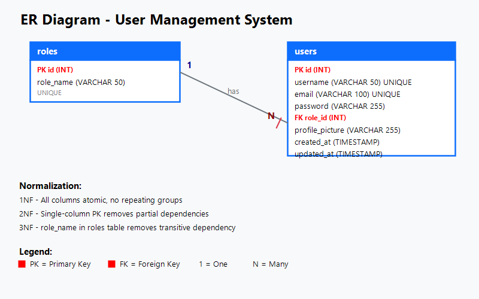

# User Management System

A production-ready **PHP & MySQL** user management system with secure authentication, role-based access control, full CRUD operations, and profile management with picture upload.

Built for **PHP 8+** and **MySQL 8+**, compatible with XAMPP without additional configuration.

---

## Features

### Authentication
- User registration with server-side validation
- Secure login using `password_verify()` and sessions
- CSRF token protection on all forms
- Session regeneration after login
- Secure logout clearing all session data
- Role-based middleware (`requireRole('Admin')`)

### CRUD Operations
- **Create** — Add users with username, email, password, and role
- **Read** — Paginated user table with search, avatars, and role badges
- **Update** — Edit user details and assign roles (admin only)
- **Delete** — Bootstrap modal confirmation with file cleanup

### Role-Based Access
- **Admin** — Full access to all users, stats dashboard, management panel
- **User** — Personal dashboard, profile editing, picture upload

### Profile Management
- Edit username and email
- Change password (with current password verification)
- Upload profile picture (JPG, PNG, GIF, WebP — max 2MB)
- Remove profile picture
- Dynamic avatar display (default SVG avatar when none uploaded)
- Live image preview before upload

### Security
- **SQL Injection** — All queries use `mysqli_prepare()` with parameterized statements
- **XSS Prevention** — All output escaped with `htmlspecialchars()`
- **CSRF Protection** — Token-based validation on every POST request
- **Password Security** — Bcrypt hashing via `password_hash()`
- **Input Validation** — Server-side validation on all inputs (email format, username pattern, password length)
- **File Upload Security** — MIME type validation, extension check, 2MB limit
- **Directory Protection** — `.htaccess` blocks PHP execution in uploads directory
- **Session Security** — `session_regenerate_id()` on login, full session destruction on logout

### Dashboard
- **Admin Dashboard** — Total users, admins, regular users, new today stats cards + full user table with role management
- **User Dashboard** — Personal stats, profile card, recent users table

### UI & UX
- Bootstrap 5.3 responsive design
- Bootstrap Icons throughout
- Dark sidebar navigation
- Modern gradient auth pages (login/register)
- Toast notifications for real-time feedback
- Loading spinners during form submission
- Password show/hide toggle
- Auto-dismissing alerts
- Client-side form validation

---

## Technologies Used

| Technology | Purpose |
|---|---|
| PHP 8.x | Server-side scripting |
| MySQL 8.x | Database |
| Apache (.htaccess) | URL rewriting & security |
| Bootstrap 5.3 | Responsive UI framework |
| Bootstrap Icons 1.11 | Icon library |
| JavaScript (vanilla) | Client-side interactivity |
| CSS3 | Custom styling & animations |

---

## Folder Structure

```
├── config/
│   ├── database.php          # MySQLi connection (singleton)
│   └── constants.php         # App-wide constants (upload limits, validation rules)
├── includes/
│   ├── header.php            # HTML header + responsive navbar + sidebar
│   ├── footer.php            # Scripts + toast container + loading spinner
│   ├── auth_check.php        # Session check + role-based access middleware
│   └── functions.php         # Helper functions (avatar, badge, flash, CSRF)
├── admin/
│   ├── dashboard.php         # Admin dashboard with stats & user management table
│   ├── add_user.php          # Create new user form
│   ├── edit_user.php         # Edit existing user form
│   └── delete_user.php       # Delete user with file cleanup
├── assets/
│   ├── css/
│   │   └── style.css         # Custom styles (sidebar, auth, cards, responsive)
│   ├── js/
│   │   └── app.js            # JavaScript (toasts, image preview, password toggle, spinner)
│   ├── img/
│   │   └── default-avatar.svg # Default avatar for users without profile picture
│   └── uploads/              # Profile picture uploads (PHP execution blocked via .htaccess)
├── sql/
│   └── schema.sql            # Database schema + seed data
├── index.php                 # Landing page / user dashboard
├── login.php                 # User login
├── register.php              # User registration
├── logout.php                # Session destruction
├── profile.php               # Profile management (info, password, picture tabs)
├── .htaccess                 # Root-level security rules
├── ER_Diagram.png            # Entity-Relationship diagram
└── README.md                 # Project documentation
```

---

## Installation Guide

### 1. Requirements
- XAMPP (or any Apache + PHP 8+ + MySQL 8+ stack)
- Web browser

### 2. Setup Steps

```bash
# 1. Copy the project to your web root
#    Windows (XAMPP): C:\xampp\htdocs\task3
#    macOS (MAMP):    /Applications/MAMP/htdocs/task3
#    Linux (LAMP):    /var/www/html/task3
```

### 3. Database Setup

**Option A — phpMyAdmin (recommended):**
1. Open `http://localhost/phpmyadmin`
2. Go to **Import** tab
3. Click **Choose File** and select `sql/schema.sql`
4. Click **Go**

**Option B — MySQL CLI:**
```bash
mysql -u root -p < sql/schema.sql
```

### 4. Configuration

The default configuration in `config/database.php` works with XAMPP out of the box:
```php
define('DB_HOST', 'localhost');
define('DB_USER', 'root');
define('DB_PASS', '');
define('DB_NAME', 'user_management');
```

### 5. Run

Open your browser and navigate to:
```
http://localhost/task3
```

### 6. Default Admin Credentials

| Username | Password | Role |
|---|---|---|
| `admin` | `admin123` | Admin |

---

## Database Design

### ER Diagram



### Tables

#### `roles`
| Column | Type | Constraints |
|---|---|---|
| id | INT | PRIMARY KEY, AUTO_INCREMENT |
| role_name | VARCHAR(50) | NOT NULL, UNIQUE |

#### `users`
| Column | Type | Constraints |
|---|---|---|
| id | INT | PRIMARY KEY, AUTO_INCREMENT |
| username | VARCHAR(50) | NOT NULL, UNIQUE |
| email | VARCHAR(100) | NOT NULL, UNIQUE |
| password | VARCHAR(255) | NOT NULL |
| role_id | INT | NOT NULL, DEFAULT 2, FOREIGN KEY → roles(id) |
| profile_picture | VARCHAR(255) | DEFAULT NULL |
| created_at | TIMESTAMP | DEFAULT CURRENT_TIMESTAMP |
| updated_at | TIMESTAMP | ON UPDATE CURRENT_TIMESTAMP |

### Normalization

| Normal Form | Status | Explanation |
|---|---|---|
| **1NF** | ✓ | All columns contain atomic values; no repeating groups or arrays |
| **2NF** | ✓ | Single-column primary key (id) eliminates any partial dependency |
| **3NF** | ✓ | `role_name` is stored in `roles` table only; `users` references via `role_id` (no transitive dependency) |

### Indexes
- `idx_users_email` — Fast email lookups
- `idx_users_role` — Efficient role-based queries
- `idx_users_created` — Sort by registration date

---

## User Roles

### Admin
- Full access to all system features
- View user statistics dashboard
- Create, read, update, and delete any user
- Assign/change user roles
- View all registered users

### Regular User
- Personal dashboard with profile overview
- Edit own profile (name, email)
- Change password
- Upload/remove profile picture
- View recent users

---

## Security Features

| Feature | Implementation |
|---|---|
| SQL Injection Prevention | `mysqli_prepare()` with parameterized queries |
| Cross-Site Scripting (XSS) | `htmlspecialchars()` on all output |
| Cross-Site Request Forgery (CSRF) | Unique token per session, validated on all POST |
| Password Storage | `password_hash()` with bcrypt algorithm |
| Session Security | `session_regenerate_id()` after login |
| Input Validation | Server-side validation on all form submissions |
| File Upload Validation | MIME type check, extension whitelist, size limit (2MB) |
| Directory Protection | `.htaccess` blocks PHP execution in `assets/uploads/` |
| Self-Deletion Prevention | Users cannot delete their own account |
| Sensitive Files Protection | `.htaccess` blocks direct access to `config/`, `includes/`, `sql/` |

---

## API / Route Summary

| URL | Method | Auth | Description |
|---|---|---|---|
| `/login.php` | GET, POST | No | User login |
| `/register.php` | GET, POST | No | User registration |
| `/logout.php` | GET | Yes | Logout |
| `/index.php` | GET | No | Home / User dashboard |
| `/profile.php` | GET, POST | Yes | Profile management |
| `/admin/dashboard.php` | GET | Admin | Admin dashboard + user table |
| `/admin/add_user.php` | GET, POST | Admin | Create user |
| `/admin/edit_user.php?id=N` | GET, POST | Admin | Edit user |
| `/admin/delete_user.php?id=N` | GET | Admin | Delete user |

---

## Screenshots

*(Add screenshots of your deployed application here)*

| Page | Description |
|---|---|
| Login | Gradient card with password toggle |
| Register | Full validation form |
| User Dashboard | Stats cards + profile + recent users |
| Admin Dashboard | Stats + user management table |
| Profile — Info | Edit username/email |
| Profile — Password | Change password form |
| Profile — Picture | Upload with live preview |

---

## Future Improvements

- Email verification during registration
- "Forgot password" with reset link
- Pagination for large user lists
- Search/filter users by name, email, or role
- Activity logging (audit trail)
- Two-factor authentication (2FA)
- API endpoints (RESTful JSON)
- Dark mode toggle
- Export users to CSV/PDF
- Email notifications

---

## License

This project is created as part of a **Full Stack Development Internship — Task 3**.

---

## Support

For issues or questions, please refer to the project repository or contact the development team.
